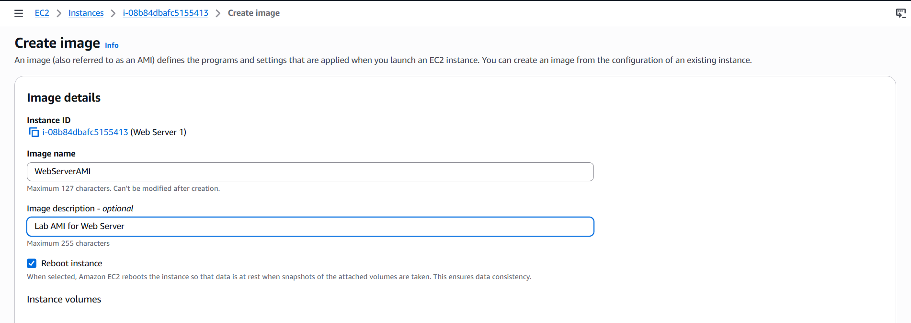
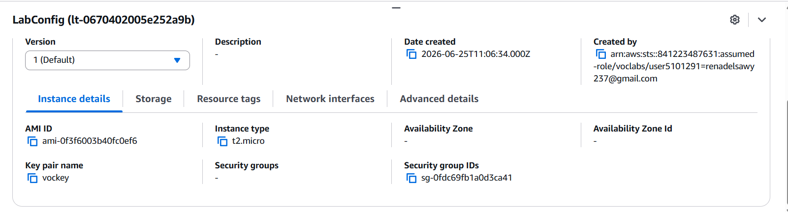

# 🚀 Lab 6: Scale and Load Balance Your Architecture

## 📖 Overview

This lab demonstrates how to improve application availability and scalability using **Amazon EC2 Auto Scaling** and an **Application Load Balancer (ALB)**.

---

## Task 1: Create an AMI

Create an Amazon Machine Image (AMI) from the existing EC2 instance to use in the launch template.

---

## Task 2: Create a Target Group & Load Balancer

Create a target group, then configure an Application Load Balancer to distribute incoming traffic.

### Target Group

### Application Load Balancer

---

## Task 3: Create a Launch Template & Auto Scaling Group

Create a Launch Template using the AMI, then create an Auto Scaling Group to automatically launch and manage EC2 instances.

### Launch Template Configuration

### Auto Scaling Group

---

## AWS Services

* Amazon EC2
* Amazon Machine Image (AMI)
* Elastic Load Balancing (ALB)
* Auto Scaling
* Target Groups

---
