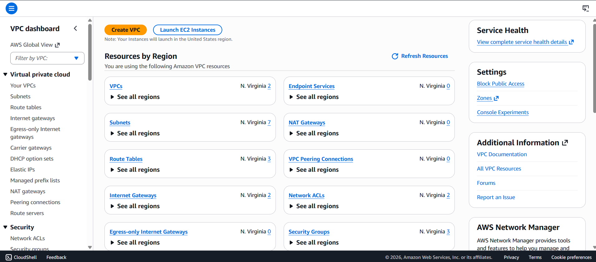
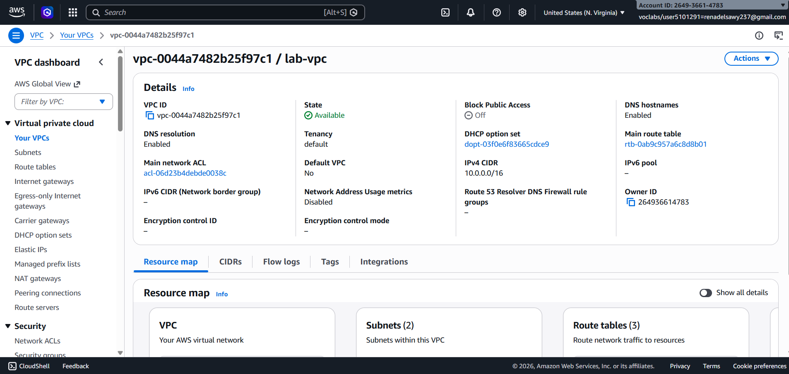
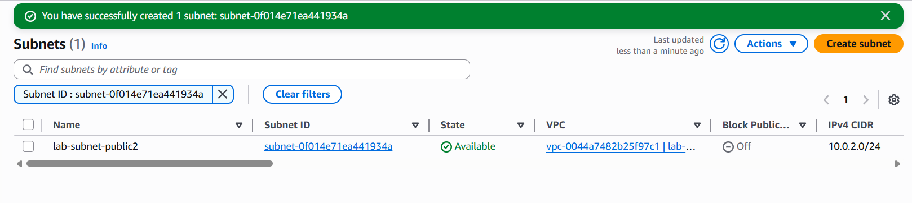
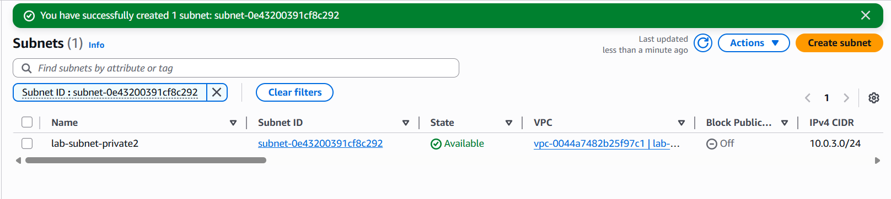
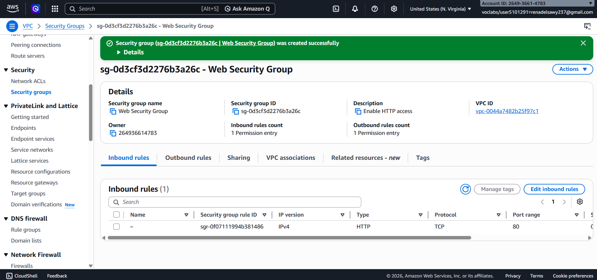
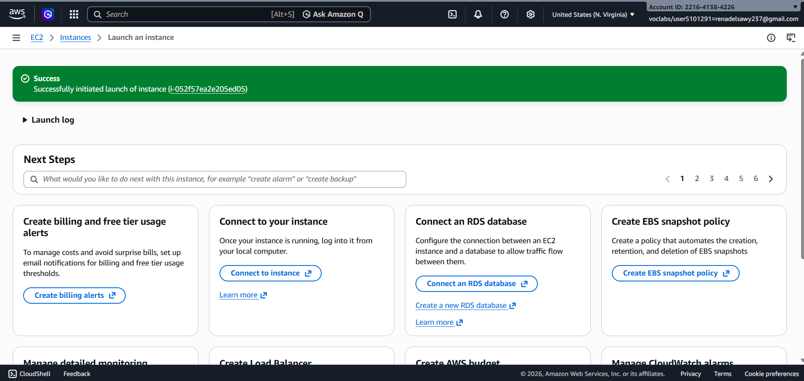
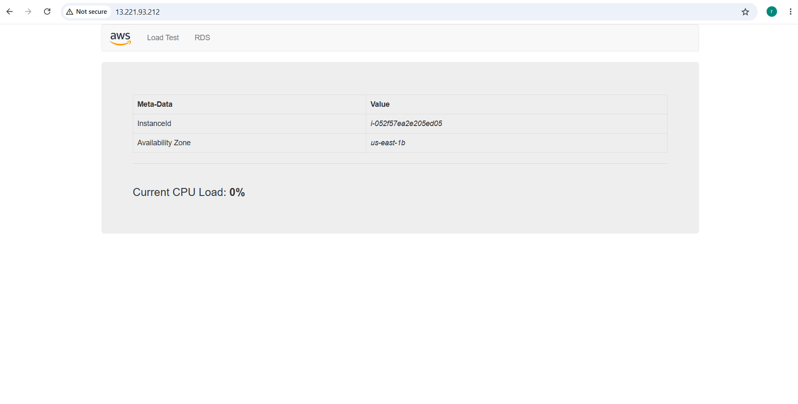

# Build  VPC and Launch a Web Server


## 1. Create a VPC
### VPC settings
* Choose VPC and more.
* Under Name tag auto-generation, keep Auto-generate selected, however change the value from project to lab.
* Keep the IPv4 CIDR block set to 10.0.0.0/16
* For Number of Availability Zones, choose 1.
* For Number of public subnets, keep the 1 setting.
* For Number of private subnets, keep the 1 setting.
* Expand the Customize subnets CIDR blocks section
    * Change Public subnet CIDR block in us-east-1a to 10.0.0.0/24
    * Change Private subnet CIDR block in us-east-1a to 10.0.1.0/24
* Set NAT gateways to In 1 AZ.
* Set VPC endpoints to None.
* Keep both DNS hostnames and DNS resolution enabled.




## 2. Create Additional Subnets
1. Public Subnet
    * VPC ID:  lab-vpc (select from the menu).
    * Subnet name: lab-subnet-public2
    * Availability Zone: Select the second Availability Zone (for example, us-east-1b)
    * IPv4 CIDR block: 10.0.2.0/24



2. Private Subnet
    * VPC ID: lab-vpc
    * Subnet name: lab-subnet-private2
    * Availability Zone: Select the second Availability Zone (for example, us-east-1b)
    * IPv4 CIDR block: 10.0.3.0/24



## 3. Route tables
1. Select  the lab-rtb-private1-us-east-1a 
2. Choose the Subnet associations tab
3. In the Explicit subnet associations panel, choose Edit subnet associations
4. Leave lab-subnet-private1-us-east-1a selected, but also select  lab-subnet-private2.
5. Select the  lab-rtb-public route table
6. Choose the Subnet associations tab.
7. In the Explicit subnet associations area, choose Edit subnet associations
8. Leave lab-subnet-public1-us-east-1a selected, but also select  lab-subnet-public2.

## 4. Create a VPC Security Group
* Security group name: Web Security Group
* Description: Enable HTTP access
* VPC: choose the X to remove the currently selected VPC, then from the drop down list choose lab-vpc
* choose Add rule
* Configure the following settings:
    * Type: HTTP
    * Source: Anywhere-IPv4
    * Description: Permit web requests



## 5. Launch a Web Server Instance
* search for and choose EC2 to open the EC2 console
* choose Launch instance
* Give it the name Web Server 1
* Choose an AMI from which to create the instance:
    * In the list of available Quick Start AMIs, keep the default Amazon Linux selected. 
    * Also keep the default Amazon Linux 2023 AMI selected.
* In the Instance type panel, keep the default t2.micro selected.
* From the Key pair name menu, select vockey.
* Configure the Network settings:
    * Next to Network settings, choose Edit, then configure: 
    * Network: lab-vpc 
    * Subnet: lab-subnet-public2 (not Private!)
    * Auto-assign public IP: Enable
    * choose  Select existing security group
    * For Common security groups, select  Web Security Group
* Configure a script to run on the instance when it launches: 
    ```
    #!/bin/bash
    # Install Apache Web Server and PHP
    dnf install -y httpd wget php mariadb105-server
    # Download Lab files
    wget https://aws-tc-largeobjects.s3.us-west-2.amazonaws.com/CUR-TF-100-ACCLFO-2/2-lab2-vpc/s3/lab-app.zip
    unzip lab-app.zip -d /var/www/html/
    # Turn on web server
    chkconfig httpd on
    service httpd start
    ```


## Launch Web Server
