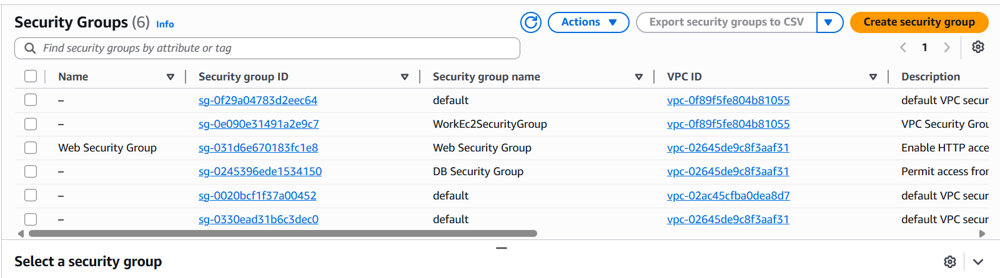
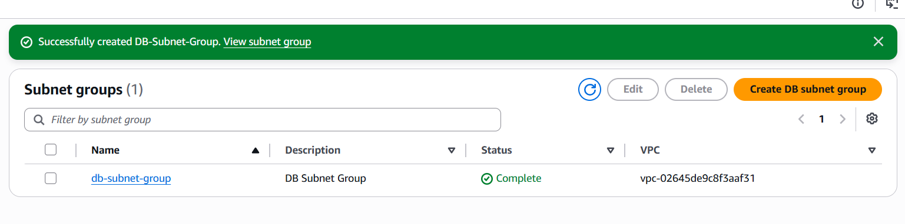
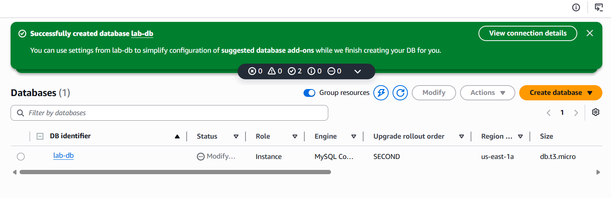
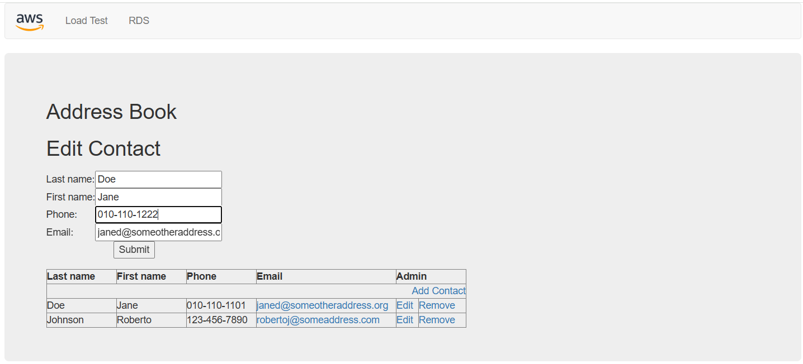
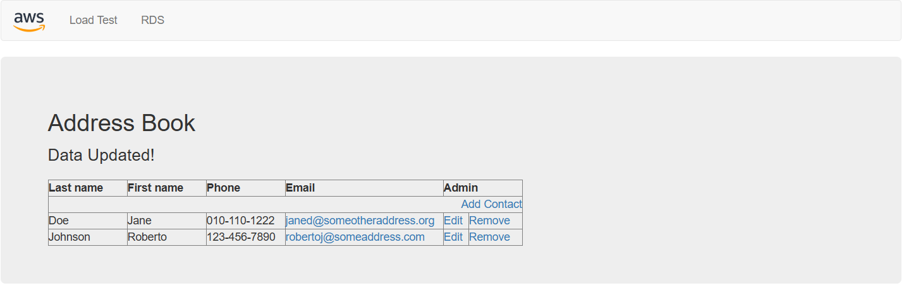
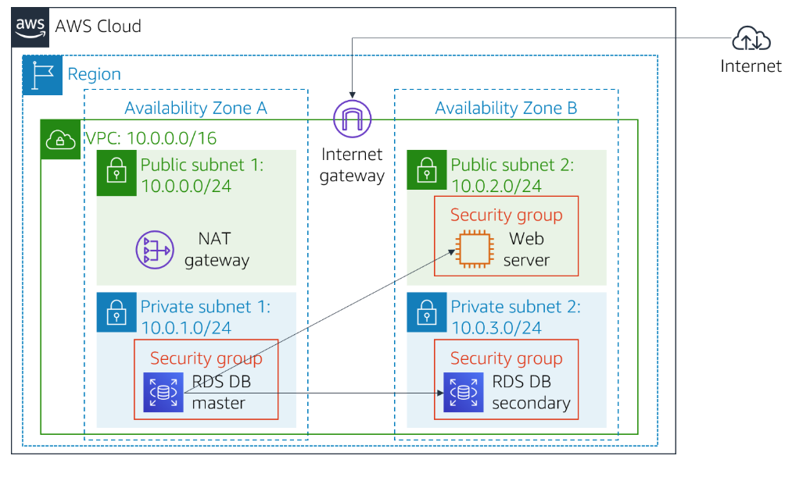

# 🚀 Lab 5: Amazon RDS

## 📖 Overview

This lab demonstrates how to create and configure an **Amazon RDS MySQL** database and connect it to an Amazon EC2 web application.

---

## Task 1: Create a Security Group

Create a **DB Security Group** and allow **MySQL (3306)** access from the **Web Security Group**.

---

## Task 2: Create a DB Subnet Group

Create a **DB Subnet Group** in **Lab VPC** using two Availability Zones and their corresponding subnets.

---

## Task 3: Create an Amazon RDS Instance

Configure the database with:

* Engine: **MySQL**
* Template: **Dev/Test**
* Deployment: **Multi-AZ**
* DB Identifier: **lab-db**
* Security Group: **DB Security Group**
* Initial Database: **lab**

---

## Task 4: Connect the Web Application

Open the EC2 Web Server, configure the RDS connection, and verify the database integration.

### Before

### After

---

## Architecture

---

## AWS Services

* Amazon EC2
* Amazon RDS
* Amazon VPC
* Security Groups

---