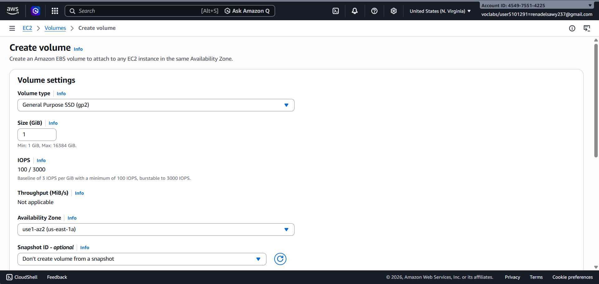
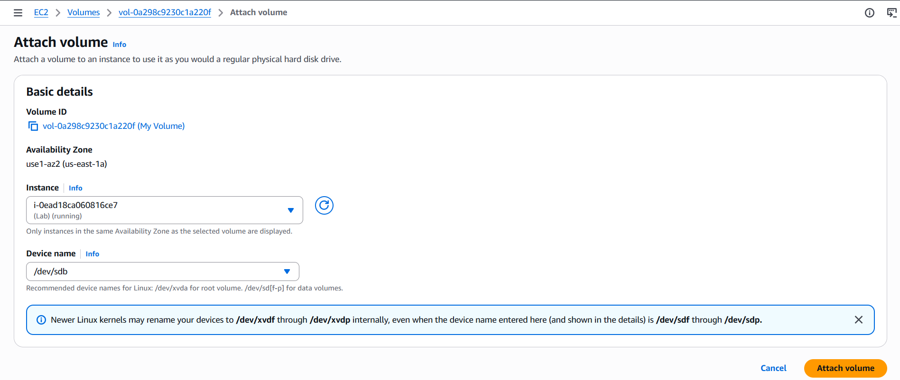
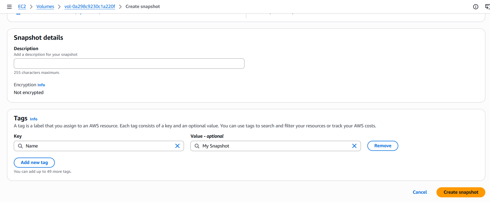

# 🚀 Lab 4: Working with Amazon EBS

## 📖 Overview
This lab demonstrates how to create, attach, configure, and manage an **Amazon Elastic Block Store (EBS)** volume for an Amazon EC2 instance. It also covers creating an EBS snapshot for backup and recovery purposes.

---

## 🎯 Objectives

By the end of this lab, you will be able to:

- Create a new Amazon EBS volume.
- Attach the volume to an Amazon EC2 instance.
- Connect to the EC2 instance using SSH.
- Create and configure a Linux file system.
- Mount the EBS volume.
- Verify storage configuration.
- Store and retrieve data from the mounted volume.
- Create an Amazon EBS Snapshot.
- Validate snapshot functionality by deleting and restoring data.

---

# 📝 Tasks

## Task 1: Create a New EBS Volume

Create a new Amazon EBS volume from the AWS Management Console.

**Screenshot**



---

## Task 2: Attach the Volume to an EC2 Instance

Attach the newly created EBS volume to your running Amazon EC2 instance.

**Steps**

- Select the created EBS volume.
- Open **Actions**.
- Choose **Attach Volume**.
- Select the target EC2 instance.
- Attach the volume.

**Screenshot**



---

## Task 3: Connect to the Amazon EC2 Instance

Connect to your EC2 instance using SSH.

**Screenshot**


---

## Task 4: Create and Configure the File System

Configure the attached EBS volume inside the Linux instance.

### Performed Operations

- View available storage devices.
- Create an **ext3** file system.
- Create a mount directory.
- Mount the EBS volume.
- Verify the mount configuration.
- Check available storage after mounting.
- Create a file on the mounted volume.
- Write text into the file.
- Verify the stored data.

### Configuration Screenshots


---

## Task 5: Create an Amazon EBS Snapshot

Create a snapshot of the EBS volume for backup purposes.

**Screenshot**



After creating the snapshot, delete the test file to simulate data loss and validate recovery.

**Screenshot**


---

# Linux Commands Used

```bash
lsblk
sudo mkfs.ext3 /dev/xvdf
sudo mkdir /mnt/data-store
sudo mount /dev/xvdf /mnt/data-store
df -h
cat /etc/fstab
echo "Hello World" | sudo tee /mnt/data-store/file.txt
cat /mnt/data-store/file.txt
```

---

# 📚 AWS Services Used

- Amazon EC2
- Amazon Elastic Block Store (EBS)
- Amazon EBS Snapshots

---

# Learning Outcomes

After completing this lab, you will understand how to:

- Provision Amazon EBS storage.
- Attach storage to EC2 instances.
- Configure Linux file systems.
- Mount persistent storage.
- Store persistent data on EBS.
- Create snapshots for backup and disaster recovery.

---